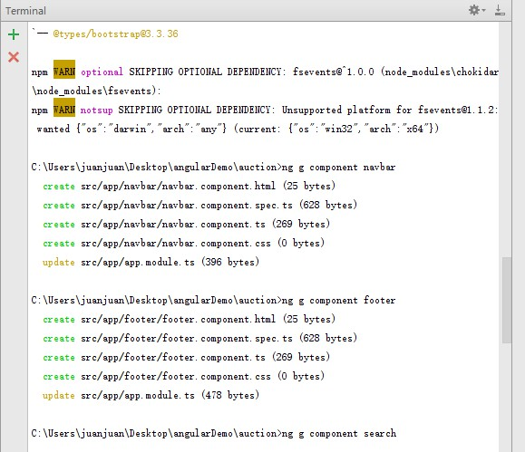

# 安装环境

### 1.安装[nodejs](https://nodejs.org/en/download/)
首先要安装nodejs，如果你的电脑已经装过了，最好确认是比较新的版本，否则可能会出问题。 
没有安装的直接去nodejs官网下载nodejs安装。安装过程很简单，官网有教程。

下载地址：[https://nodejs.org/en/download](https://nodejs.org/en/download/)

安装完成后，windows+R 输入cmd，打开命令
输入 **node -v** 看看安装版本 


出现版本号说明node安装成功

### 2.安装cnmp
由于Angular Cli的一些资源被墙掉了，所以这里我们使用淘宝的镜像去下载安装，否则会很慢并且很容易出问题。

 淘宝镜像网址：[https://npm.taobao.org/](https://npm.taobao.org/)
 
 #### 使用node npm命令安装
``` bash
npm install -g cnpm –registry=https://registry.npm.taobao.org
```
之后安装angular cli的时候我们就用**cnpm**命令即可。包括其他被墙的资源也可以用cnmp去下载安装！

### 3.安装Angular Cli

之前电脑上如果安装过angular cli老版本的话建议先卸载，然后重新安装
#### 卸载老版本：
``` bash
npm uninstall -g angular-cli 
```
#### 卸载新版本：
``` bash
npm uninstall -g @angular/cli
```
#### 清除下缓存 ：
``` bash
npm cache clean
```

#### 然后开始安装，记住，最好用**cnpm**

``` bash
cnpm install -g @angular/cli@latest
```

安装完成后输入 **ng help** 查看是否安装成功 


出现angular的版本号说明安装成功

# angular 搭建项目

### 1.搭建项目框架
安装完命令行工具后我们就可以创建Angular项目了。 
首先，切换到项目的存放目录
输入:
``` bash
ng new [projectName] 
```
projectName就是你的项目名称，例如，我创建一个aution项目


然后耐心等待，这里会下载很多东西，所以不要着急


这就表示创建完成了

### 1.运行项目
首先切换至项目目录，然后执行**npm install**命令
在项目目录输入：
 ``` bash
npm install
 ```
 
 出现上图所示表示依赖包下载成功了
 
 然后运行项目，执行 **ng server** 命令
 
  ``` bash
ng server
  ```


 出现上图所示表示项目运行成功了，默认是运行在4200端口上的。
  
 打开浏览器，输入**localhost:4200**即可访问。
 
 

 大功告成！一个Angular的项目就创建好了
 
 # 目录结构介绍
 
 首先看一下整体的目录结构： 
 
 
 
 可以看到，命令行工具自动生成了很多文件和目录,现在来介绍一下这些目录是干什么的
 
 #### **首层目录**
 
``` bash
node_modules        第三方依赖包存放目录
e2e                 端到端的测试目录  用来做自动测试的
src                 应用源代码目录  
.angular-cli.json   Angular命令行工具的配置文件。后期可能会去修改它，引一些其他的第三方的包  比如jquery等
karma.conf.js       karma是单元测试的执行器，karma.conf.js是karma的配置文件
package.json        这是一个标准的npm工具的配置文件，这个文件里面列出了该应用程序所使用的第三方依赖包。实际上我们在新建项目的时候，等了半天就是在下载第三方依赖包。下载完成后会放在node_modules这个目录中，后期我们可能会修改这个文件。
protractor.conf.js  也是一个做自动化测试的配置文件
README.md           说明文件
tslint.json         是tslint的配置文件，用来定义TypeScript代码质量检查的规则，不用管它
```
#### **src目录：**

```bash
app目录               包含应用的组件和模块，我们要写的代码都在这个目录
assets目录            资源目录，存储静态资源的  比如图片
environments目录      环境配置。Angular是支持多环境开发的，我们可以在不同的环境下（开发环境，测试环境，生产环境）共用一套代码，主要用来配置环境的
index.html          整个应用的根html，程序启动就是访问这个页面
main.ts             整个项目的入口点，Angular通过这个文件来启动项目
polyfills.ts        主要是用来导入一些必要库，为了让Angular能正常运行在老版本下
styles.css          主要是放一些全局的样式
tsconfig.app.json   TypeScript编译器的配置,添加第三方依赖的时候会修改这个文件
tsconfig.spec.json  不用管
test.ts             也是自动化测试用的
typings.d.ts        不用管
```
#### **app目录（重点）**
app目录是我们要编写的代码目录。我们写的代码都是放在这个目录。 
一个Angular程序至少需要一个模块和一个组件。在我们新建项目的时候命令行已经默认生成出来了。 


app.component.ts：这个文件表示组件， 
组件是Angular应用的基本构建模块，可以理解为一段带有业务逻辑和数据的Html 

angular启动时加载的页面是 src/index.html

angular启动时加载的脚本是 src/main.ts

# angular 引入第三方库

在当前文件目录子下输入**npm install [包名]** 命令
```bash
npm install [包名] --save
```
引入第三方包：
在angular-cli.json中配置第三方包路径


js的路径写在scripts数组中，css的路径写在css数组中

注意： 

引入之后并不能直接用，因为这些包是javascript的文件，typescript不能直接使用它

所以，我们需要引入这些文件的类型描述文件

```bash
npm install @type/[包名] --save-dev
```
例如：npm install @type/jquery --save-dev

这样第三方库就可以使用了

# 创建组件

输入命令：
```bash
ng g component [组件名称]
```

组件名称自定义


如图所示就是创建成功

创建好的组件会生成在 app文件夹中

如图


angular会在app.module.ts文件中自动引入这些组件，如图

