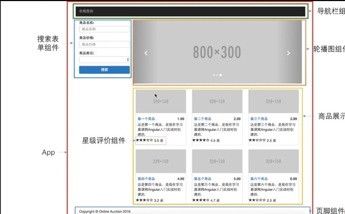
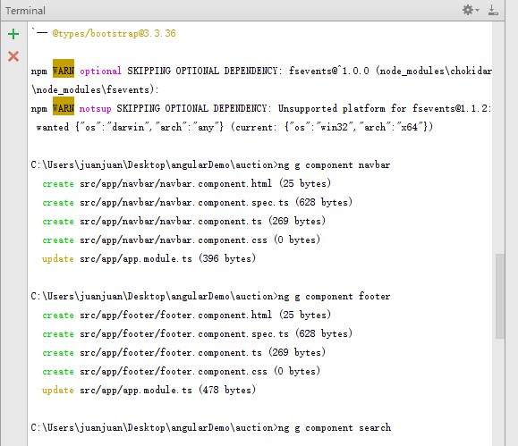
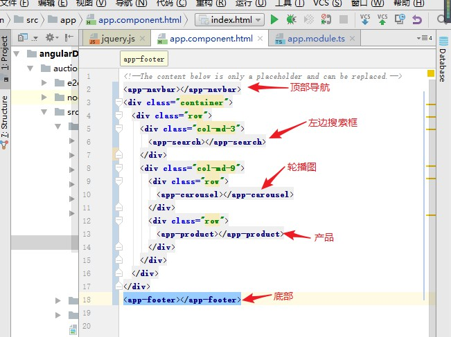
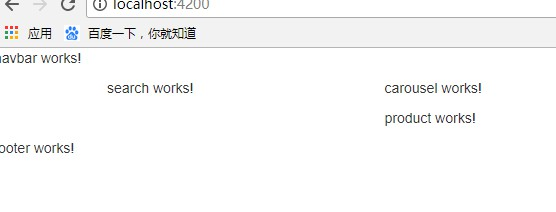

---
title: angular在线竞拍程序实战
date: 2017-10-31 16:10:35
tags: angular
---

做这个项目需要的环境：**node** **angular/cli**

首先电脑得安装node和angular，具体步骤可以参考[angular环境搭建!](https://juanjuan666.github.io/2017/11/01/angular/)

# 1.搭建项目结构
首先，搭建项目结构，并且引入第三方包

比如这个项目需要 **jquery** **bootstrap**
引入这些包的类型描述，详细请看[angular环境搭建!](https://juanjuan666.github.io/2017/11/01/angular/)

# 2.创建组件

这个项目需要的组件：

app组件   
导航栏组件   
页脚组件    
搜索表单组件   
轮播图组件   
商品展示组件  
星级评价组件

如图：

输入命令：
```bash
ng g component [组件名称]
```
如图所示



# 3.构建组件模板

在app/app.component.html中构建模板



效果图：



# 4.开发组件
导航栏组件